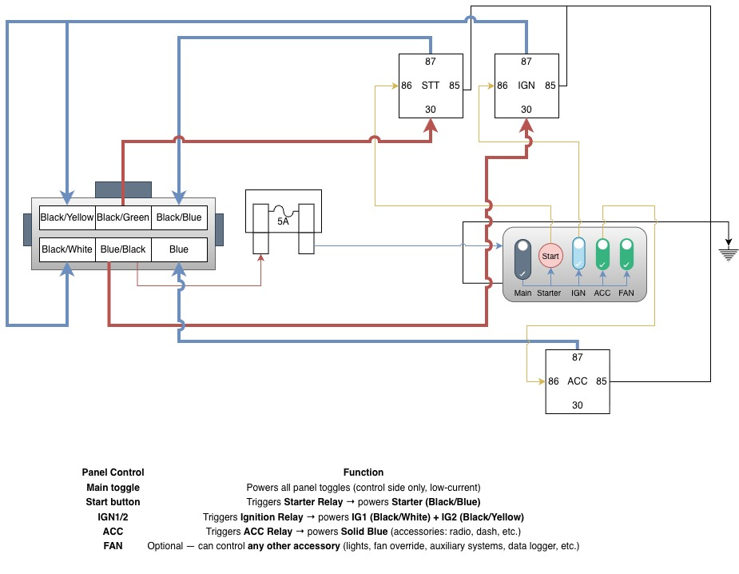

# Mazda RX-7 FD3S (13B-REW) – Build Notes & Planned Upgrades

---

## 🔧 Internal Technical Build Documentation

### 1️⃣ Engine / Sensor Baseline

- Engine: 13B-REW, ~5k miles, previous owner reports built by Rotary Performance, 3mm apex seals, ported
- **3-bar MAP sensor kit (Banzai Racing) installed**
- Wideband O2 sensor connected to Link G4X
- Verify vacuum lines and all sensor connections before startup
- Minimum sensors required for first idle:  
  - Crank Angle Sensor (CAS)  
  - Throttle Position Sensor (TPS)  
  - Coolant Temperature Sensor  
  - 3-bar MAP sensor  
  - Wideband O2 (recommended)

**Startup Verification Goals:**

- Clean start and stable idle  
- No misfires  
- Correct timing sync in Link G4X  
- Validate dwell and trigger settings  
- **Use OEM igniter and coil packs for startup**
- Ignition switch bypassed via ignition panel (diagram found below)

---

### 2️⃣ LS D585 Coil Conversion (Optional Buyer Upgrade)

- LS coil wiring is **not currently installed**  
- Planned wiring documented for buyer reference if they choose to upgrade:  
  - Repurpose OEM igniter harness for LS coil triggers  
  - Dedicated +12V fused power and engine block grounds  
  - Trigger wires: 20 AWG from Link G4X IGN outputs to LS coil triggers  
  - Keep OEM harness intact; unused wires capped and isolated  
  - Optional plug-and-play igniter-delete harness for cleaner integration  

---

### 3️⃣ ECU Configuration (Using OEM Ignition for Startup)

- Ignition Mode: Direct Spark  
- Ignition Type: Logic Level  
- Spark Edge: Falling  
- Dwell @ 14V: ~3.2–3.5 ms  
- Multi-spark: OFF  

---

### 4️⃣ Physical Mounting / Wiring

- OEM coils and igniter remain in stock location for startup  
- LS coil mounting / bracket solution left as buyer option  
- Heat shielding, short equal-length wires, and custom routing documented for potential future upgrade  

---

### 5️⃣ Validation Checklist

- Confirm spark on all four events using OEM ignition  
- Verify tachometer signal behavior  
- Check dwell and trigger settings in ECU  
- Confirm clean idle + high-RPM stability  
- Monitor for misfire under initial startup and low boost  

---

## 🚀 Buyer-Facing Overview

**Ignition Modernization (Optional Upgrade):**

- LS smart coil transition documented for future buyer  
- Consistent spark delivery potential  
- Modernized ignition architecture  
- Improved boost reliability  
- Cleaner wiring layout if installed  

**Electrical Refinement:**

- Dedicated fused power circuit for LS coils (optional)  
- Improved grounding plan (optional)  
- Modular, reversible design  

**Reliability Focus:**

- OEM ignition ensures safe startup  
- High-RPM spark stability verified with OEM coils  
- LS upgrade optional for tuning headroom  

**Long-Term Vision:**

- Standalone ECU compatibility preserved  
- Modular, serviceable electrical system  
- OEM integrity maintained  

---

## ⚙️ Safety & Pre-Startup Notes

- Confirm 3-bar MAP sensor reads correctly  
- Verify wideband O2 operation  
- Check all vacuum lines  
- Keep initial boost low  
- Only start engine after all minimum sensors are verified
